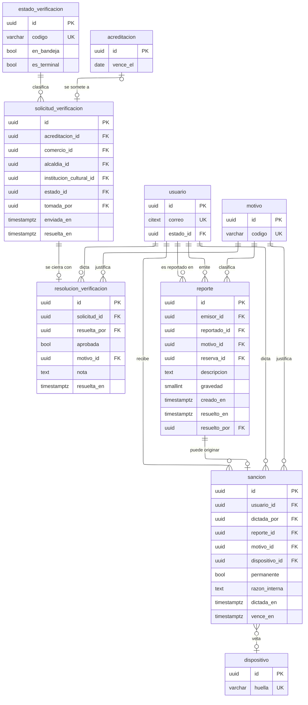

---
hide:
  - toc
icon: lucide/gavel
---

# Moderación y sanciones

```mermaid
---
config:
  elk:
    mergeEdges: false
    nodePlacementStrategy: NETWORK_SIMPLEX
  fontFamily: monospace
  layout: elk
---
erDiagram
    solicitud_verificacion {
        uuid id PK
        uuid acreditacion_id FK
        uuid comercio_id FK
        uuid alcaldia_id FK
        uuid institucion_cultural_id FK
        uuid estado_id FK
        uuid tomada_por FK
        timestamptz enviada_en
        timestamptz resuelta_en
    }
    estado_verificacion {
        uuid id PK
        varchar codigo UK
        bool en_bandeja
        bool es_terminal
    }
    resolucion_verificacion {
        uuid id PK
        uuid solicitud_id FK
        uuid resuelta_por FK
        bool aprobada
        uuid motivo_id FK
        text nota
        timestamptz resuelta_en
    }
    reporte {
        uuid id PK
        uuid emisor_id FK
        uuid reportado_id FK
        uuid motivo_id FK
        uuid reserva_id FK
        text descripcion
        smallint gravedad
        timestamptz creado_en
        timestamptz resuelto_en
        uuid resuelto_por FK
    }
    sancion {
        uuid id PK
        uuid usuario_id FK
        uuid dictada_por FK
        uuid reporte_id FK
        uuid motivo_id FK
        uuid dispositivo_id FK
        bool permanente
        text razon_interna
        timestamptz dictada_en
        timestamptz vence_en
    }
    usuario {
        uuid id PK
        citext correo UK
        uuid estado_id FK
    }
    dispositivo {
        uuid id PK
        varchar huella UK
    }
    motivo {
        uuid id PK
        varchar codigo UK
    }
    acreditacion {
        uuid id PK
        date vence_el
    }
    estado_verificacion ||--o{ solicitud_verificacion : "clasifica"
    acreditacion |o--o| solicitud_verificacion : "se somete a"
    solicitud_verificacion ||--o| resolucion_verificacion : "se cierra con"
    usuario ||--o{ resolucion_verificacion : "dicta"
    motivo ||--o{ resolucion_verificacion : "justifica"
    usuario ||--o{ reporte : "emite"
    usuario ||--o{ reporte : "es reportado en"
    motivo ||--o{ reporte : "clasifica"
    reporte ||--o| sancion : "puede originar"
    usuario ||--o{ sancion : "recibe"
    usuario ||--o{ sancion : "dicta"
    motivo ||--o{ sancion : "justifica"
    sancion }o--o| dispositivo : "veta"
```

