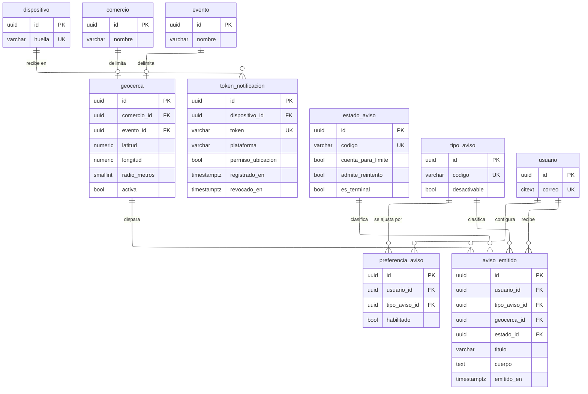

---
hide:
  - toc
icon: lucide/bell
---

# Notificaciones

```mermaid
---
config:
  elk:
    mergeEdges: false
    nodePlacementStrategy: NETWORK_SIMPLEX
  fontFamily: monospace
  layout: elk
---
erDiagram
    geocerca {
        uuid id PK
        uuid comercio_id FK
        uuid evento_id FK
        numeric latitud
        numeric longitud
        smallint radio_metros
        bool activa
    }
    token_notificacion {
        uuid id PK
        uuid dispositivo_id FK
        varchar token UK
        varchar plataforma
        bool permiso_ubicacion
        timestamptz registrado_en
        timestamptz revocado_en
    }
    preferencia_aviso {
        uuid id PK
        uuid usuario_id FK
        uuid tipo_aviso_id FK
        bool habilitado
    }
    aviso_emitido {
        uuid id PK
        uuid usuario_id FK
        uuid tipo_aviso_id FK
        uuid geocerca_id FK
        uuid estado_id FK
        varchar titulo
        text cuerpo
        timestamptz emitido_en
    }
    estado_aviso {
        uuid id PK
        varchar codigo UK
        bool cuenta_para_limite
        bool admite_reintento
        bool es_terminal
    }
    tipo_aviso {
        uuid id PK
        varchar codigo UK
        bool desactivable
    }
    dispositivo {
        uuid id PK
        varchar huella UK
    }
    usuario {
        uuid id PK
        citext correo UK
    }
    comercio {
        uuid id PK
        varchar nombre
    }
    evento {
        uuid id PK
        varchar nombre
    }
    dispositivo ||--o{ token_notificacion : "recibe en"
    usuario ||--o{ preferencia_aviso : "configura"
    tipo_aviso ||--o{ preferencia_aviso : "se ajusta por"
    usuario ||--o{ aviso_emitido : "recibe"
    tipo_aviso ||--o{ aviso_emitido : "clasifica"
    geocerca ||--o{ aviso_emitido : "dispara"
    estado_aviso ||--o{ aviso_emitido : "clasifica"
    comercio ||--o| geocerca : "delimita"
    evento ||--o| geocerca : "delimita"
```

