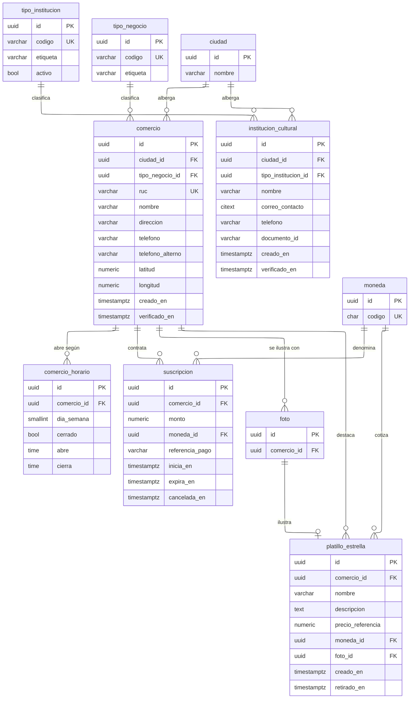

---
hide:
  - toc
icon: lucide/store
---

# Organizaciones y comercios

```mermaid
---
config:
  elk:
    mergeEdges: false
    nodePlacementStrategy: NETWORK_SIMPLEX
  fontFamily: monospace
  layout: elk
---
erDiagram
    comercio {
        uuid id PK
        uuid ciudad_id FK
        uuid tipo_negocio_id FK
        varchar ruc UK
        varchar nombre
        varchar direccion
        varchar telefono
        varchar telefono_alterno
        numeric latitud
        numeric longitud
        timestamptz creado_en
        timestamptz verificado_en
    }
    comercio_horario {
        uuid id PK
        uuid comercio_id FK
        smallint dia_semana
        bool cerrado
        time abre
        time cierra
    }
    platillo_estrella {
        uuid id PK
        uuid comercio_id FK
        varchar nombre
        text descripcion
        numeric precio_referencia
        uuid moneda_id FK
        uuid foto_id FK
        timestamptz creado_en
        timestamptz retirado_en
    }
    suscripcion {
        uuid id PK
        uuid comercio_id FK
        numeric monto
        uuid moneda_id FK
        varchar referencia_pago
        timestamptz inicia_en
        timestamptz expira_en
        timestamptz cancelada_en
    }
    institucion_cultural {
        uuid id PK
        uuid ciudad_id FK
        uuid tipo_institucion_id FK
        varchar nombre
        citext correo_contacto
        varchar telefono
        varchar documento_id
        timestamptz creado_en
        timestamptz verificado_en
    }
    tipo_institucion {
        uuid id PK
        varchar codigo UK
        varchar etiqueta
        bool activo
    }
    tipo_negocio {
        uuid id PK
        varchar codigo UK
        varchar etiqueta
    }
    ciudad {
        uuid id PK
        varchar nombre
    }
    moneda {
        uuid id PK
        char codigo UK
    }
    foto {
        uuid id PK
        uuid comercio_id FK
    }
    ciudad ||--o{ comercio : "alberga"
    ciudad ||--o{ institucion_cultural : "alberga"
    tipo_negocio ||--o{ comercio : "clasifica"
    tipo_institucion ||--o{ institucion_cultural : "clasifica"
    comercio ||--o{ comercio_horario : "abre según"
    comercio ||--o{ platillo_estrella : "destaca"
    comercio ||--o{ suscripcion : "contrata"
    comercio ||--o{ foto : "se ilustra con"
    moneda ||--o{ platillo_estrella : "cotiza"
    moneda ||--o{ suscripcion : "denomina"
    foto ||--o| platillo_estrella : "ilustra"
```

