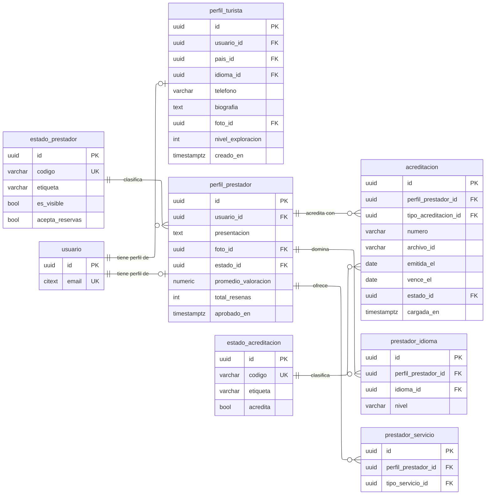

---
hide:
  - toc
icon: lucide/id-card
---

# Perfiles y acreditaciones

`perfil_turista.usuario_id` y `perfil_prestador.usuario_id` son únicas: a lo sumo
un perfil de cada tipo por persona. Es la restricción que hace que la relación
sea de cero o uno y no de varios.

`perfil_prestador.promedio_valoracion` y `total_resenas` son datos derivados que
mantiene un disparador sobre `resena`. Se aceptan como denormalización porque se
consultan en cada búsqueda de prestadores; mantenerlos desde la base y no desde
la aplicación garantiza que ninguna vía de escritura los deje obsoletos.

`acreditacion.archivo_id` es la referencia al documento en el almacenamiento, no el
documento. La base guarda metadatos y el archivo vive fuera: un PDF de diez
megabytes por prestador convertiría cualquier respaldo en un problema.

| Restricción | Sobre | Por qué |
| --- | --- | --- |
| Único | `perfil_turista.usuario_id` y `perfil_prestador.usuario_id` | Un perfil de cada tipo por persona |
| Verificación | `acreditacion.vence_el` posterior a `emitida_el` | Una acreditacion no vence antes de emitirse |
| Único parcial | `acreditacion` por prestador y tipo donde el estado acredita | Una sola acreditacion vigente por tipo de documento |
| Único | `prestador_idioma` por prestador e idioma | Un idioma no se declara dos veces |
| Verificación | `promedio_valoracion` entre 1 y 5, o nulo sin reseñas | Un promedio fuera de rango delata un disparador roto |

El paso a suspensión cuando vence la última acreditacion no lo hace la aplicación:
un proceso programado compara `vence_el` contra la fecha del servidor y escribe
la transición. Si dependiera de que alguien abra el portal, un prestador con
licencia vencida seguiría recibiendo reservas.
