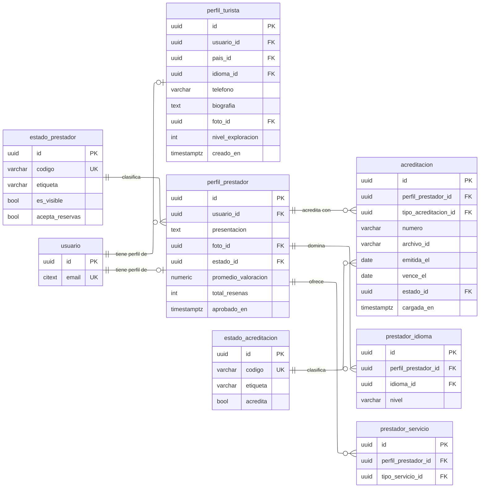

---
hide:
  - toc
icon: lucide/id-card
---

# Perfiles y acreditaciones

```mermaid
---
config:
  elk:
    mergeEdges: false
    nodePlacementStrategy: NETWORK_SIMPLEX
  fontFamily: monospace
  layout: elk
---
erDiagram
    direction LR
    perfil_turista {
        uuid id PK
        uuid usuario_id FK
        uuid pais_id FK
        uuid idioma_id FK
        varchar telefono
        text biografia
        uuid foto_id FK
        int nivel_exploracion
        timestamptz creado_en
    }
    perfil_prestador {
        uuid id PK
        uuid usuario_id FK
        text presentacion
        uuid foto_id FK
        uuid estado_id FK
        numeric promedio_valoracion
        int total_resenas
        timestamptz aprobado_en
    }
    estado_prestador {
        uuid id PK
        varchar codigo UK
        varchar etiqueta
        bool es_visible
        bool acepta_reservas
    }
    acreditacion {
        uuid id PK
        uuid perfil_prestador_id FK
        uuid tipo_acreditacion_id FK
        varchar numero
        varchar archivo_id
        date emitida_el
        date vence_el
        uuid estado_id FK
        timestamptz cargada_en
    }
    estado_acreditacion {
        uuid id PK
        varchar codigo UK
        varchar etiqueta
        bool acredita
    }
    prestador_idioma {
        uuid id PK
        uuid perfil_prestador_id FK
        uuid idioma_id FK
        varchar nivel
    }
    prestador_servicio {
        uuid id PK
        uuid perfil_prestador_id FK
        uuid tipo_servicio_id FK
    }
    usuario {
        uuid id PK
        citext email UK
    }
    usuario ||--o| perfil_turista : "tiene perfil de"
    usuario ||--o| perfil_prestador : "tiene perfil de"
    estado_prestador ||--o{ perfil_prestador : "clasifica"
    perfil_prestador ||--o{ acreditacion : "acredita con"
    estado_acreditacion ||--o{ acreditacion : "clasifica"
    perfil_prestador ||--o{ prestador_idioma : "domina"
    perfil_prestador ||--o{ prestador_servicio : "ofrece"
```

