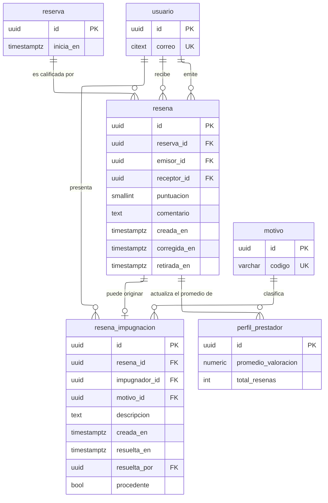

---
hide:
  - toc
icon: lucide/star
---

# Reputación

```mermaid
---
config:
  elk:
    mergeEdges: false
    nodePlacementStrategy: NETWORK_SIMPLEX
  fontFamily: monospace
  layout: elk
---
erDiagram
    resena {
        uuid id PK
        uuid reserva_id FK
        uuid emisor_id FK
        uuid receptor_id FK
        smallint puntuacion
        text comentario
        timestamptz creada_en
        timestamptz corregida_en
        timestamptz retirada_en
    }
    resena_impugnacion {
        uuid id PK
        uuid resena_id FK
        uuid impugnador_id FK
        uuid motivo_id FK
        text descripcion
        timestamptz creada_en
        timestamptz resuelta_en
        uuid resuelta_por FK
        bool procedente
    }
    reserva {
        uuid id PK
        timestamptz inicia_en
    }
    usuario {
        uuid id PK
        citext correo UK
    }
    motivo {
        uuid id PK
        varchar codigo UK
    }
    perfil_prestador {
        uuid id PK
        numeric promedio_valoracion
        int total_resenas
    }
    reserva ||--o{ resena : "es calificada por"
    usuario ||--o{ resena : "emite"
    usuario ||--o{ resena : "recibe"
    resena ||--o| resena_impugnacion : "puede originar"
    usuario ||--o{ resena_impugnacion : "presenta"
    motivo ||--o{ resena_impugnacion : "clasifica"
    resena ||--o{ perfil_prestador : "actualiza el promedio de"
```

