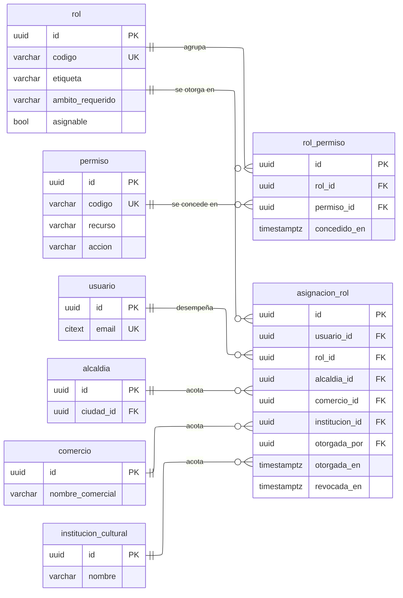

---
hide:
  - toc
icon: lucide/shield-check
---

# Roles y permisos

`asignacion_rol` lleva tres llaves foráneas de ámbito y una restricción de
verificación que exige que a lo sumo una esté presente. Las tres nulas significan
alcance global, que es el caso del personal interno. `rol.ambito_requerido`
declara cuál de las tres exige cada rol, y un disparador comprueba que la
asignación la traiga.

Se eligió tres columnas nulables y no un par genérico de tipo e identificador
porque así cada referencia conserva su llave foránea real. Con un par genérico
nada impide apuntar a un comercio que ya no existe.

`asignacion_rol` no se borra: revocar es escribir `revocada_en`. Es lo que
permite responder quién tenía qué acceso el día en que ocurrió algo, que es
justamente lo que se pregunta después de un incidente.

| Restricción | Sobre | Por qué |
| --- | --- | --- |
| Verificación | A lo sumo una de las tres llaves de ámbito no es nula | Un rol se acota a un solo objeto |
| Verificación | El ámbito presente coincide con `rol.ambito_requerido` | Un operador de comercio no se asigna a una ciudad |
| Único parcial | Usuario y rol donde `revocada_en` es nula | Una persona no acumula el mismo rol dos veces |
| Único | `rol_permiso` por rol y permiso | Un permiso no se concede dos veces al mismo rol |
| Único | `permiso` por recurso y acción | El código es derivable, no una segunda fuente |

El permiso nunca se concede directamente a un usuario: no existe tabla
`usuario_permiso`. Retirar un acceso es siempre revocar una asignación de rol o
quitar un permiso del rol, en un solo lugar auditable.
