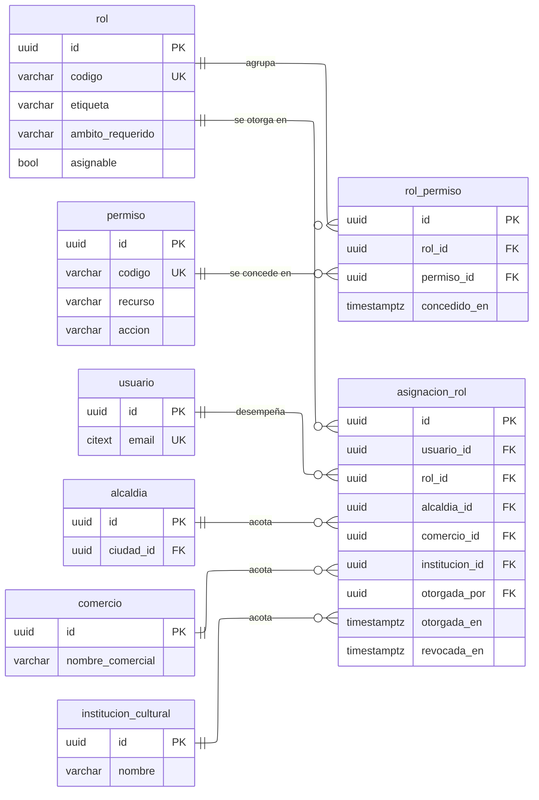

---
hide:
  - toc
icon: lucide/shield-check
---

# Roles y permisos

```mermaid
---
config:
  elk:
    mergeEdges: false
    nodePlacementStrategy: NETWORK_SIMPLEX
  fontFamily: monospace
  layout: elk
---
erDiagram
    direction LR
    rol {
        uuid id PK
        varchar codigo UK
        varchar etiqueta
        varchar ambito_requerido
        bool asignable
    }
    permiso {
        uuid id PK
        varchar codigo UK
        varchar recurso
        varchar accion
    }
    rol_permiso {
        uuid id PK
        uuid rol_id FK
        uuid permiso_id FK
        timestamptz concedido_en
    }
    asignacion_rol {
        uuid id PK
        uuid usuario_id FK
        uuid rol_id FK
        uuid alcaldia_id FK
        uuid comercio_id FK
        uuid institucion_id FK
        uuid otorgada_por FK
        timestamptz otorgada_en
        timestamptz revocada_en
    }
    usuario {
        uuid id PK
        citext email UK
    }
    alcaldia {
        uuid id PK
        uuid ciudad_id FK
    }
    comercio {
        uuid id PK
        varchar nombre_comercial
    }
    institucion_cultural {
        uuid id PK
        varchar nombre
    }
    rol ||--o{ rol_permiso : "agrupa"
    permiso ||--o{ rol_permiso : "se concede en"
    usuario ||--o{ asignacion_rol : "desempeña"
    rol ||--o{ asignacion_rol : "se otorga en"
    alcaldia ||--o{ asignacion_rol : "acota"
    comercio ||--o{ asignacion_rol : "acota"
    institucion_cultural ||--o{ asignacion_rol : "acota"
```

