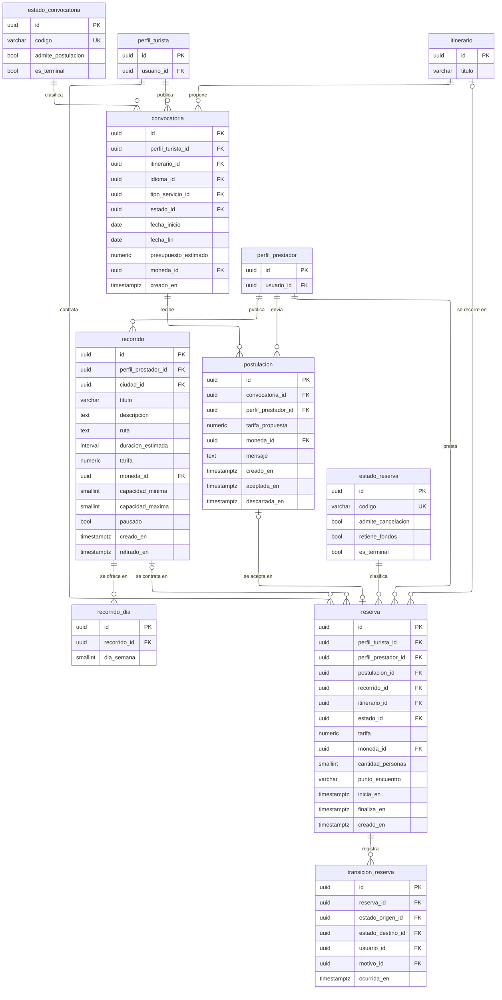

---
hide:
  - toc
icon: lucide/handshake
---

# Servicios y reservas

```mermaid
---
config:
  elk:
    mergeEdges: false
    nodePlacementStrategy: NETWORK_SIMPLEX
  fontFamily: monospace
  layout: elk
---
erDiagram
    recorrido {
        uuid id PK
        uuid perfil_prestador_id FK
        uuid ciudad_id FK
        varchar titulo
        text descripcion
        text ruta
        interval duracion_estimada
        numeric tarifa
        uuid moneda_id FK
        smallint capacidad_minima
        smallint capacidad_maxima
        bool pausado
        timestamptz creado_en
        timestamptz retirado_en
    }
    recorrido_dia {
        uuid id PK
        uuid recorrido_id FK
        smallint dia_semana
    }
    convocatoria {
        uuid id PK
        uuid perfil_turista_id FK
        uuid itinerario_id FK
        uuid idioma_id FK
        uuid tipo_servicio_id FK
        uuid estado_id FK
        date fecha_inicio
        date fecha_fin
        numeric presupuesto_estimado
        uuid moneda_id FK
        timestamptz creado_en
    }
    estado_convocatoria {
        uuid id PK
        varchar codigo UK
        bool admite_postulacion
        bool es_terminal
    }
    postulacion {
        uuid id PK
        uuid convocatoria_id FK
        uuid perfil_prestador_id FK
        numeric tarifa_propuesta
        uuid moneda_id FK
        text mensaje
        timestamptz creado_en
        timestamptz aceptada_en
        timestamptz descartada_en
    }
    reserva {
        uuid id PK
        uuid perfil_turista_id FK
        uuid perfil_prestador_id FK
        uuid postulacion_id FK
        uuid recorrido_id FK
        uuid itinerario_id FK
        uuid estado_id FK
        numeric tarifa
        uuid moneda_id FK
        smallint cantidad_personas
        varchar punto_encuentro
        timestamptz inicia_en
        timestamptz finaliza_en
        timestamptz creado_en
    }
    estado_reserva {
        uuid id PK
        varchar codigo UK
        bool admite_cancelacion
        bool retiene_fondos
        bool es_terminal
    }
    transicion_reserva {
        uuid id PK
        uuid reserva_id FK
        uuid estado_origen_id FK
        uuid estado_destino_id FK
        uuid usuario_id FK
        uuid motivo_id FK
        timestamptz ocurrida_en
    }
    perfil_prestador {
        uuid id PK
        uuid usuario_id FK
    }
    perfil_turista {
        uuid id PK
        uuid usuario_id FK
    }
    itinerario {
        uuid id PK
        varchar titulo
    }
    perfil_prestador ||--o{ recorrido : "publica"
    recorrido ||--o{ recorrido_dia : "se ofrece en"
    perfil_turista ||--o{ convocatoria : "publica"
    itinerario ||--o{ convocatoria : "propone"
    estado_convocatoria ||--o{ convocatoria : "clasifica"
    convocatoria ||--o{ postulacion : "recibe"
    perfil_prestador ||--o{ postulacion : "envia"
    postulacion |o--o| reserva : "se acepta en"
    recorrido |o--o{ reserva : "se contrata en"
    itinerario |o--o{ reserva : "se recorre en"
    perfil_turista ||--o{ reserva : "contrata"
    perfil_prestador ||--o{ reserva : "presta"
    estado_reserva ||--o{ reserva : "clasifica"
    reserva ||--o{ transicion_reserva : "registra"
```

