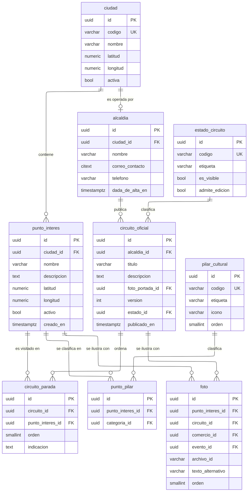

---
hide:
  - toc
icon: lucide/map
---

# Territorio y circuitos

```mermaid
---
config:
  elk:
    mergeEdges: false
    nodePlacementStrategy: NETWORK_SIMPLEX
  fontFamily: monospace
  layout: elk
---
erDiagram
    ciudad {
        uuid id PK
        varchar codigo UK
        varchar nombre
        numeric latitud
        numeric longitud
        bool activa
    }
    alcaldia {
        uuid id PK
        uuid ciudad_id FK
        varchar nombre
        citext correo_contacto
        varchar telefono
        timestamptz dada_de_alta_en
    }
    punto_interes {
        uuid id PK
        uuid ciudad_id FK
        varchar nombre
        text descripcion
        numeric latitud
        numeric longitud
        bool activo
        timestamptz creado_en
    }
    circuito_oficial {
        uuid id PK
        uuid alcaldia_id FK
        varchar titulo
        text descripcion
        uuid foto_portada_id FK
        int version
        uuid estado_id FK
        timestamptz publicado_en
    }
    estado_circuito {
        uuid id PK
        varchar codigo UK
        varchar etiqueta
        bool es_visible
        bool admite_edicion
    }
    circuito_parada {
        uuid id PK
        uuid circuito_id FK
        uuid punto_interes_id FK
        smallint orden
        text indicacion
    }
    pilar_cultural {
        uuid id PK
        varchar codigo UK
        varchar etiqueta
        varchar icono
        smallint orden
    }
    punto_pilar {
        uuid id PK
        uuid punto_interes_id FK
        uuid categoria_id FK
    }
    foto {
        uuid id PK
        uuid punto_interes_id FK
        uuid circuito_id FK
        uuid comercio_id FK
        uuid evento_id FK
        varchar archivo_id
        varchar texto_alternativo
        smallint orden
    }
    ciudad ||--o| alcaldia : "es operada por"
    punto_interes ||--o{ punto_pilar : "se clasifica en"
    pilar_cultural ||--o{ punto_pilar : "clasifica"
    ciudad ||--o{ punto_interes : "contiene"
    alcaldia ||--o{ circuito_oficial : "publica"
    estado_circuito ||--o{ circuito_oficial : "clasifica"
    circuito_oficial ||--o{ circuito_parada : "ordena"
    punto_interes ||--o{ circuito_parada : "es visitado en"
    circuito_oficial ||--o{ foto : "se ilustra con"
    punto_interes ||--o{ foto : "se ilustra con"
```

