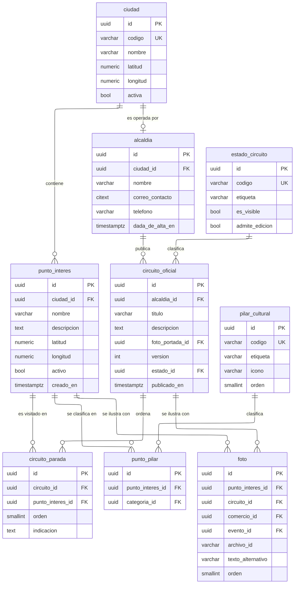

---
hide:
  - toc
icon: lucide/map
---

# Territorio y circuitos

Las coordenadas son dos columnas decimales con escala fija y rango verificado, no
un tipo geográfico nativo. Es la opción que funciona sin extensiones instaladas;
si el motor de producción las tiene, la columna cambia de tipo y las búsquedas
por radio dejan de aproximarse sobre un rectángulo.

`circuito_oficial.version` es un entero que un disparador incrementa cuando
cambia la geometría —altas, bajas o reordenamientos en `circuito_parada`— y solo
entonces. Editar el título no lo mueve, porque la aplicación usa ese número para
decidir si debe redibujar el trazado.

`foto` usa el mismo patrón de referencias excluyentes que el ámbito de un rol:
cuatro llaves nulables y una verificación que exige exactamente una presente. Una
tabla de fotos por dueño habría duplicado cuatro veces las mismas columnas.

| Restricción | Sobre | Por qué |
| --- | --- | --- |
| Único | `alcaldia.ciudad_id` | Una sola alcaldía por ciudad |
| Verificación | Latitud entre 10.7 y 15.1; longitud entre -87.7 y -82.6 | El territorio nicaragüense; una coordenada fuera es un error de captura |
| Único | `circuito_parada` por circuito y orden, diferida | Reordenar intercambia posiciones dentro de una transacción |
| Único | `circuito_parada` por circuito y punto de interés | Un lugar no se visita dos veces en el mismo recorrido |
| Verificación | `foto` con exactamente una llave de dueño presente | Una foto pertenece a una sola cosa |
| Único | `punto_pilar` por punto y categoría | Un pilar no se asigna dos veces al mismo lugar |
| Disparador | Un circuito visible conserva al menos dos paradas | Un recorrido de un punto no se puede trazar |

La eliminación de un circuito restringe si tiene itinerarios que lo siguen: hay
que despublicarlo primero. La de un punto de interés anula la referencia en las
paradas de itinerario que lo copiaron, porque esas paradas ya guardan su propio
nombre y su propia coordenada y sobreviven sin él.
