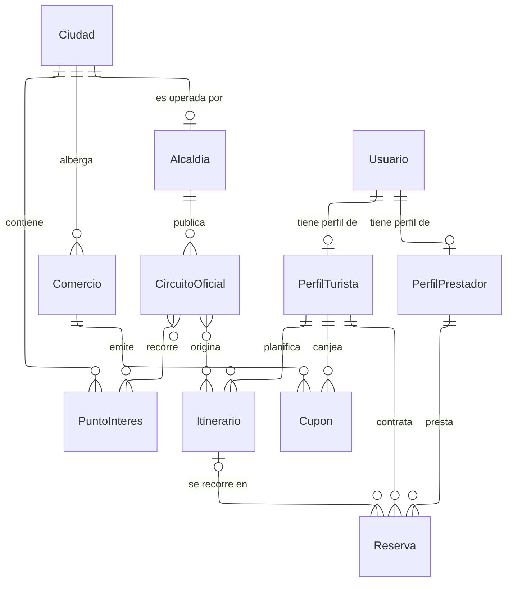

# Diagramas entidad-relación

Representación gráfica del [modelo de dominio](../../modelo-dominio/index.md) en
dos niveles de resolución. El diagrama muestra la forma; la restricción declarada
en la ficha de cada tabla es la que la impone. Cuando ambos parezcan discrepar,
la restricción es la fuente de verdad y el diagrama es lo que hay que corregir.

Los dos niveles cubren públicos distintos. El conceptual responde qué existe y
cómo se relaciona, y se lee sin conocer el motor de base de datos. El físico
responde con qué columnas y llaves se sostiene esa relación, y se lee con el
esquema al lado.

---

## Cómo se lee un diagrama

Cada caja es una **entidad**: una clase de cosa de la que el sistema guarda
información. Cada línea es una **relación**, y lleva un verbo que se lee de
izquierda a derecha.

Los símbolos de los extremos indican cuántos elementos participan. El símbolo
pegado a una entidad dice cuántas de **esa** entidad intervienen, visto desde la
del otro extremo.

| Símbolo                   | Junto a una entidad significa |
| ------------------------- | ----------------------------- |
| <code>&#124;&#124;</code> | exactamente una               |
| <code>o&#124;</code>      | ninguna o una                 |
| <code>o{</code>           | ninguna, una o varias         |
| <code>}&#124;</code>      | una o varias                  |

Un ejemplo con la primera relación del diagrama de abajo:

> `Ciudad ||--o{ Comercio : "alberga"` se lee «una ciudad alberga ninguno, uno o
> varios comercios», y en sentido contrario «cada comercio está en exactamente
> una ciudad».

Cuando ambos extremos admiten varias —la forma `}o--o{`— la relación es de varios
a varios. En el modelo físico ninguna relación de ese tipo existe tal cual: se
resuelve siempre con una tabla intermedia que guarda un par por fila. Esa tabla
no aparece en el nivel conceptual porque es un mecanismo, no un concepto del
negocio.

---

## Los dos niveles

|             | Conceptual                                          | Físico                                                 |
| ----------- | --------------------------------------------------- | ------------------------------------------------------ |
| Nombres     | En mayúscula inicial, como los usa el negocio       | En minúscula con guion bajo, como la tabla real        |
| Contiene    | Entidades, cardinalidades y el verbo de la relación | Todas las columnas con su tipo y su condición de llave |
| No contiene | Columnas, tipos, llaves, tablas intermedias         | Restricciones, disparadores e índices                  |
| Alcance     | Un archivo por módulo                               | Un archivo por módulo, espejo del conceptual           |

Las restricciones, los disparadores y los índices no aparecen en ningún diagrama.
Viven en la ficha de la tabla, en forma de tabla y de código, porque son reglas
con condiciones y excepciones que una arista no puede expresar sin volverse
ilegible.

---

## Nivel 0

Las once entidades que sostienen el resto del sistema.

La lectura completa cabe en una frase: la alcaldía de una Ciudad Creativa publica
circuitos oficiales sobre los puntos de interés de su territorio; el turista los
recorre tal cual o los ajusta en su propio itinerario, contrata a un prestador
verificado para acompañarlo y canjea en los comercios de esa ciudad las insignias
que gana explorándola.

### Qué es cada entidad

| Entidad           | Qué representa                                                                                                                                                                                                                                                                 |
| ----------------- | ------------------------------------------------------------------------------------------------------------------------------------------------------------------------------------------------------------------------------------------------------------------------------ |
| `Usuario`         | Una persona registrada en el sistema, sea quien sea. Es una sola entidad para todos los papeles: el turista, el guía, el traductor y el operador de una alcaldía o de un comercio son todos usuarios. Lo que los diferencia es el perfil que tienen y el rol que se les asignó |
| `PerfilTurista`   | El perfil de quien viaja: su nacionalidad, su idioma preferido y su nivel de exploración. Solo lo tienen los usuarios que usan la aplicación móvil                                                                                                                             |
| `PerfilPrestador` | El perfil profesional de un guía certificado por el INTUR o de un traductor, con sus acreditaciones verificadas, sus idiomas y sus tarifas                                                                                                                                     |
| `Ciudad`          | Una de las diez Ciudades Creativas de la Red Nacional. Es el territorio, no el gobierno                                                                                                                                                                                        |
| `Alcaldia`        | El gobierno local de esa ciudad, dado de alta en la plataforma. Es la única autoridad que puede publicar contenido oficial                                                                                                                                                     |
| `CircuitoOficial` | El recorrido que la alcaldía publica y respalda: una secuencia ordenada de puntos de interés de su ciudad                                                                                                                                                                      |
| `PuntoInteres`    | Un lugar concreto del territorio —un mirador, un taller de artesanía, una iglesia— con su ubicación. Existe por sí mismo, aunque ningún circuito lo incluya                                                                                                                    |
| `Itinerario`      | Lo que un turista concreto se propone recorrer. Puede ser un circuito oficial seguido tal cual, una versión ajustada de él, la combinación de circuitos de varias ciudades o un recorrido armado desde cero                                                                    |
| `Reserva`         | El servicio contratado entre un turista y un prestador para recorrer un itinerario en una fecha concreta                                                                                                                                                                       |
| `Comercio`        | Una MIPYME registrada en el mapa, con su ficha, su horario y su platillo estrella                                                                                                                                                                                              |
| `Cupon`           | El descuento concreto que un turista obtuvo al canjear sus insignias, con su código de un solo uso                                                                                                                                                                             |

En los requerimientos aparece con frecuencia la palabra **cuenta**.
No es una entidad distinta de `Usuario`: es la misma fila vista
desde el lado del acceso. El modelo usa `Usuario` porque es quien
realiza las acciones del diagrama, y reserva «cuenta» para hablar de su
estado y de sus credenciales de sesión.

**Una persona es una fila, y sus papeles son perfiles aparte.** El turista y el
prestador no son dos tipos de usuario: son dos perfiles que un mismo usuario
puede tener, ninguno o uno de cada uno. Se separan porque sus datos no se
solapan: la nacionalidad y el nivel de exploración solo aplican al turista; las
acreditaciones del INTUR y la cuenta de desembolso solo al prestador. Guardarlos
todos en una misma fila dejaría la mitad de las columnas sin sentido para cada
persona. El acceso, en cambio, es idéntico para todos y por eso vive una sola vez
en `Usuario` ([D-01](../../modelo-dominio/decisiones.md#d-01)).

**La ciudad es territorio; la alcaldía es autoridad.** No son la misma entidad y
confundirlas rompe dos reglas a la vez. El circuito lo publica la alcaldía,
mientras que el comercio y el punto de interés solo están _situados_ en la
ciudad: nadie los gobierna. Colgar el comercio de la alcaldía habría insinuado
una potestad municipal sobre negocios privados que ninguna fuente respalda.

**Una ciudad puede existir sin alcaldía registrada.** Es la relación de ninguna o
una entre ambas, y no es un descuido: el catálogo de las diez Ciudades Creativas
está completo desde el primer día, pero su incorporación a la plataforma es
progresiva y despareja. Una ciudad sin alcaldía dada de alta no tiene circuitos
oficiales, y aun así puede albergar comercios y puntos de interés.

**El punto de interés es compartido y sobrevive al circuito.** Un mismo lugar
aparece en varios circuitos y otorga insignias por sí mismo, así que existe como
entidad del territorio y no como propiedad de un recorrido
([D-18](../../modelo-dominio/decisiones.md#d-18)). Retirarlo de un circuito no lo
borra del mapa ni cancela lo que ya acreditó.

**Seguir un circuito tal cual también es un itinerario.** El turista no está
obligado a modificar nada para recorrer lo que publicó la alcaldía: puede tomarlo
como está ([RF-T-28][rf-t-28]). Por eso la entidad se llama `Itinerario` y no
«ruta personalizada», y por eso su relación con el circuito admite ninguno, uno
o varios.

| Modo                                  | Circuitos de origen | Paradas propias               |
| ------------------------------------- | ------------------- | ----------------------------- |
| Seguir el circuito tal cual           | uno                 | ninguna: se leen del circuito |
| Ajustar un circuito                   | uno                 | sí, desde la copia            |
| Combinar circuitos de varias ciudades | varios              | sí                            |
| Armar desde cero                      | ninguno             | sí                            |

**La reserva depende de un itinerario y de un prestador, nunca de un circuito.**
Entre el contenido oficial y el acuerdo entre dos personas se interpone siempre
el itinerario, y por eso una alcaldía puede editar o retirar su circuito sin
tocar ninguna reserva viva. El itinerario es opcional porque existe un segundo
camino: contratar directamente un recorrido publicado por el guía, cuyo trazado
es suyo.

Fuera de este nivel quedan la agenda cultural y los módulos
consumidores: mensajería, reputación, finanzas, notificaciones, moderación y
auditoría. Todos aparecen en el diagrama conceptual de su módulo.

[rf-a-01]: ../../requerimientos/funcionales/portal-alcaldias.md#rf-a-01
[rf-a-10]: ../../requerimientos/funcionales/portal-alcaldias.md#rf-a-10
[rf-t-28]: ../../requerimientos/funcionales/app-turista.md#rf-t-28
