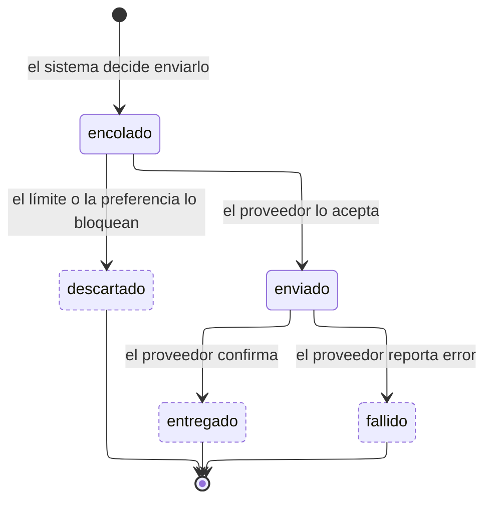

---
hide:
  - toc
icon: lucide/bell
---

# Aviso

Todo aviso deja fila, incluso el que nunca se envía. `descartado` es el estado
que registra los bloqueados por el límite de tres promocionales por hora o por la
preferencia del usuario, y es lo que permite responder por qué alguien no recibió
algo.

`enviado` significa que el proveedor lo aceptó, no que llegó. La confirmación de
entrega es un segundo evento y puede no llegar nunca.

| Estado       | `cuenta_para_limite` | `admite_reintento` | `es_terminal` |
| ------------ | :------------------: | :----------------: | :-----------: |
| `encolado`   |          no          |         no         |      no       |
| `descartado` |          no          |         no         |    **sí**     |
| `enviado`    |        **sí**        |         no         |      no       |
| `entregado`  |        **sí**        |         no         |    **sí**     |
| `fallido`    |          no          |       **sí**       |    **sí**     |

Solo `enviado` y `entregado` cuentan para el límite: un aviso descartado o
fallido no consume la cuota de la hora. El límite se evalúa contando las filas de
los últimos sesenta minutos, porque la ventana es deslizante y un contador por
hora dejaría pasar seis avisos entre las 10:59 y las 11:01.

Los avisos transaccionales no pasan por `descartado`:
su categoría los marca como no desactivables.
