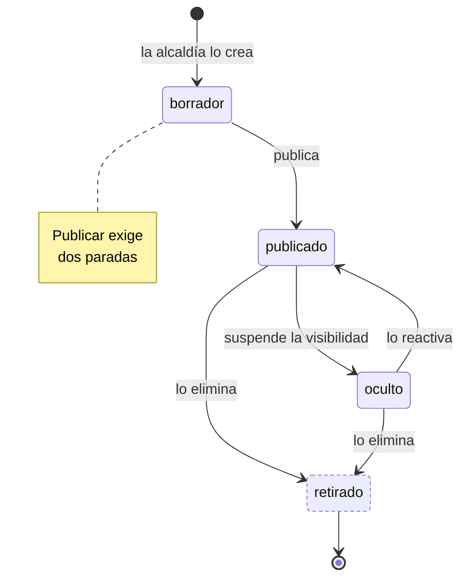

---
hide:
  - toc
icon: lucide/map
---

# Circuito oficial

Publicar exige al menos dos paradas: la transición se rechaza si el circuito no
las tiene. `oculto` es reversible y sirve para obras, clima o fuerza mayor;
`retirado` no lo es.

Ninguna de las tres transiciones alcanza a los itinerarios que ya derivaron de
él. Ocultar o retirar corta el descubrimiento, nunca lo que un turista ya tiene
en el bolsillo.

| Estado | `es_visible` | `admite_edicion` | `es_terminal` |
| --- | :-: | :-: | :-: |
| `borrador` | no | **sí** | no |
| `publicado` | **sí** | **sí** | no |
| `oculto` | no | **sí** | no |
| `retirado` | no | no | **sí** |

Editar la geometría en `publicado` incrementa `version`, y eso es lo que hace que
la aplicación redibuje el trazado. Editar el título no la mueve.

Retirar restringe si hay itinerarios que **siguen** el circuito en vivo: primero
hay que ocultarlo, lo que empuja a esos itinerarios a resolverse. Los que solo lo
tienen como origen no bloquean nada, porque ya copiaron sus paradas.
