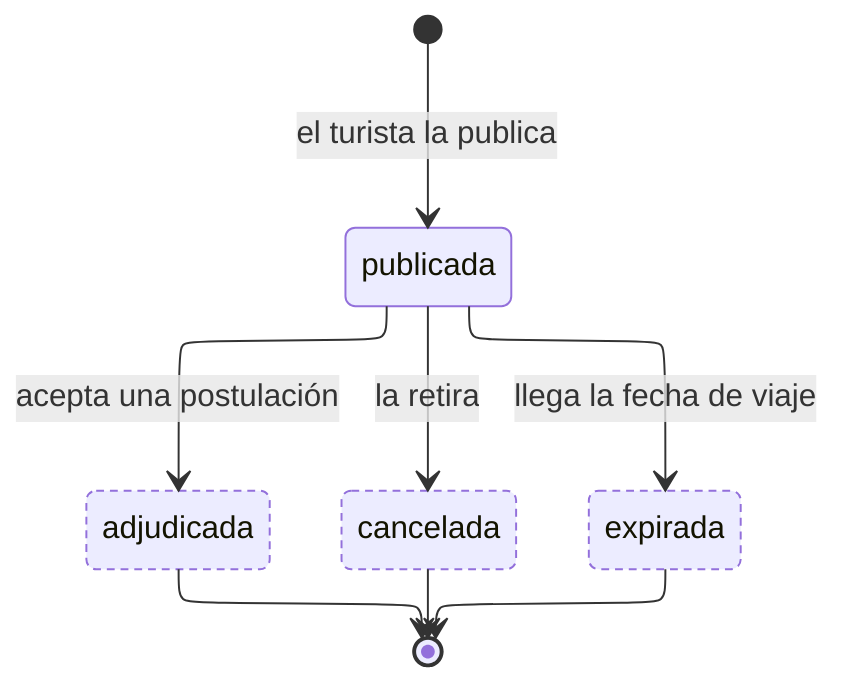

---
hide:
  - toc
icon: lucide/megaphone
---

# Convocatoria

Lo que el turista publica para que guías y traductores se postulen. Circula sin
su identidad: los datos personales aparecen al abrirse la sala de chat con quien
resulte elegido.

Si nadie se postula, el proceso programado la cierra al llegar la fecha de viaje
declarada. No hace falta un plazo aparte: la fecha ya está en la convocatoria.

| Estado       | `admite_postulacion` | `es_terminal` |
| ------------ | :------------------: | :-----------: |
| `publicada`  |        **sí**        |      no       |
| `adjudicada` |          no          |    **sí**     |
| `cancelada`  |          no          |    **sí**     |
| `expirada`   |          no          |    **sí**     |

Una convocatoria adjudicada produce **una** reserva. Contratar guía y traductor a
la vez son dos convocatorias, nunca una adjudicación doble.

Las postulaciones no tienen máquina propia: quedan `enviada`, y al adjudicar una
pasa a `aceptada` y el resto a `descartada` en la misma transacción.
