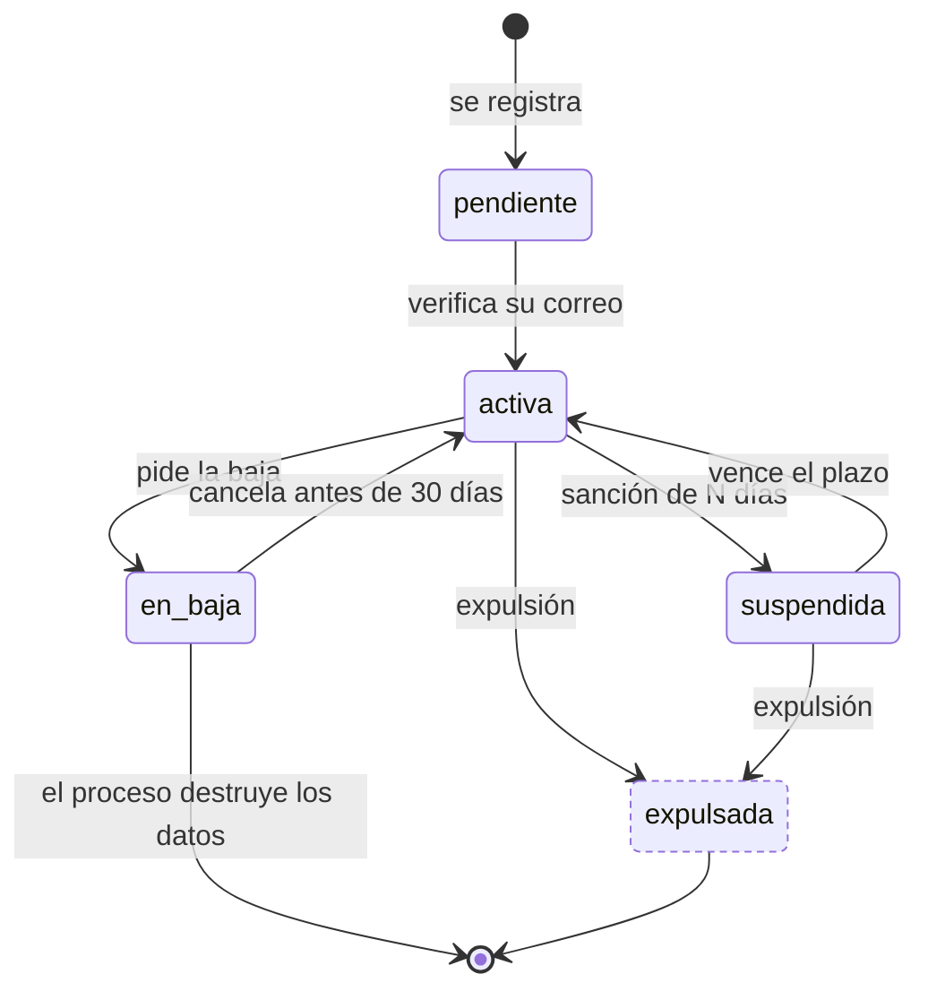

---
hide:
  - toc
icon: lucide/user-round
---

# Cuenta

`activa` es el único estado que permite operar. `suspendida`, `expulsada` y
`en_baja` revocan las sesiones vivas al entrar, de modo que la sanción alcanza al
dispositivo donde la persona ya estaba dentro.

La destrucción no es un estado: es la salida de `en_baja` a los treinta días,
ejecutada por el proceso programado.

| Estado | `permite_operar` | `revoca_sesion` | `es_terminal` |
| --- | :-: | :-: | :-: |
| `pendiente` | no | no | no |
| `activa` | **sí** | no | no |
| `suspendida` | no | **sí** | no |
| `expulsada` | no | **sí** | **sí** |
| `en_baja` | no | **sí** | no |

La baja se rechaza mientras existan servicios contratados y pagados sin prestar:
la transición a `en_baja` no ocurre, no es que ocurra y se revierta.

!!! warning "Sin definir"

    Qué pasa con una cuenta que nunca verifica su correo. Hoy se queda en
    `pendiente` de forma indefinida y ninguna fuente fija un plazo de expiración.
