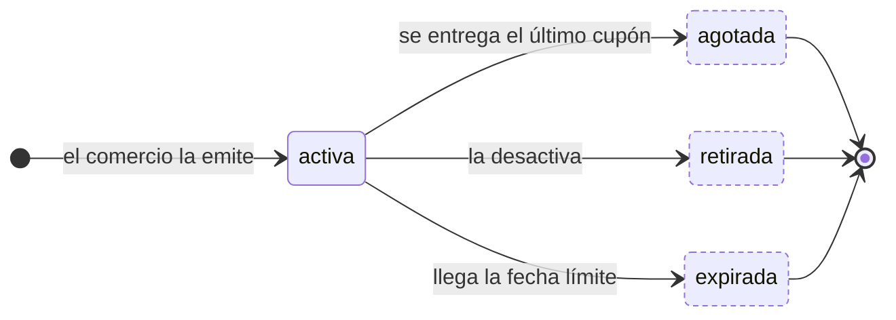
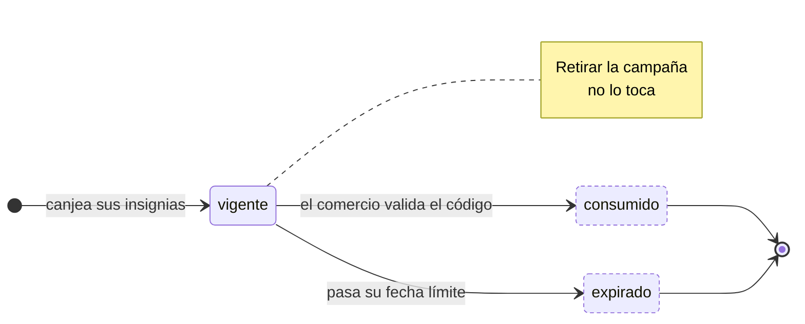

---
hide:
  - toc
icon: lucide/ticket-percent
---

# Cupón y campaña

Dos máquinas que **no** se propagan entre sí. Retirar la campaña corta la emisión
de cupones nuevos; los ya canjeados conservan su vigencia hasta la fecha límite
original.

Es la regla que hace posible el retiro anticipado sin romperle el beneficio a
nadie: el cupón copió el descuento, el comercio y la fecha en el momento del
canje, y no los lee de la campaña.

## Campaña

| Estado | `admite_canje` | `es_terminal` |
| --- | :-: | :-: |
| `activa` | **sí** | no |
| `agotada` | no | **sí** |
| `retirada` | no | **sí** |
| `expirada` | no | **sí** |

## Cupón

| Estado | `admite_validacion` | `es_terminal` |
| --- | :-: | :-: |
| `vigente` | **sí** | no |
| `consumido` | no | **sí** |
| `expirado` | no | **sí** |

El canje descuenta el saldo de insignias y emite el código en la misma
transacción: no existe un estado intermedio en el que se haya cobrado el saldo
sin entregar el código.

Validar en mostrador comprueba cuatro cosas antes de la transición: que el código
exista, que pertenezca a **ese** comercio, que siga `vigente` y que no esté
`consumido`. Un código de otro comercio falla aunque sea válido.
