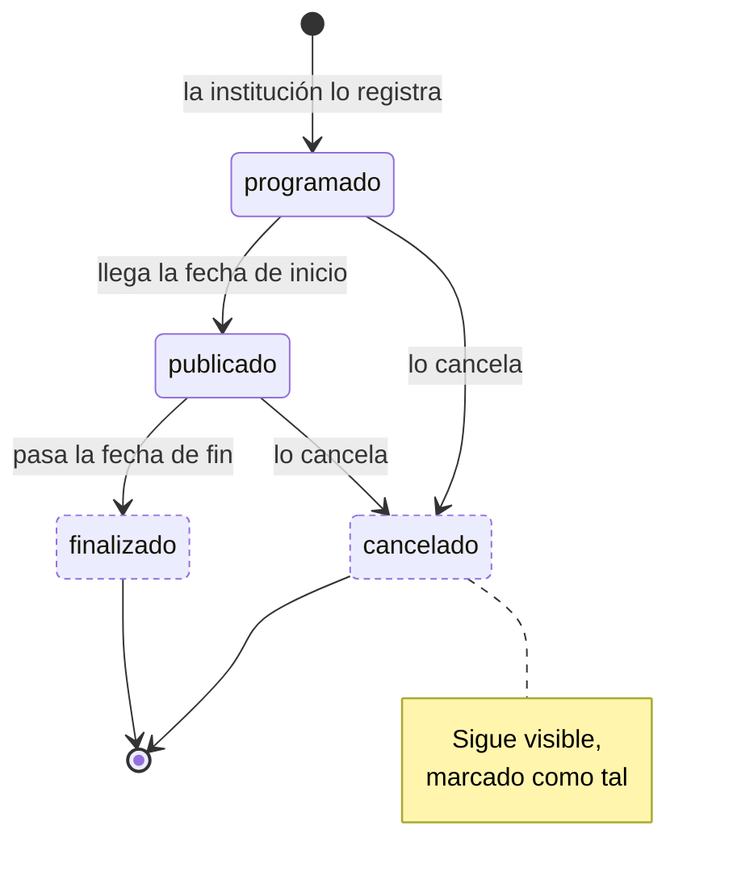

---
hide:
  - toc
icon: lucide/drama
---

# Evento cultural

La vigencia la gobierna el calendario, no la institución: el proceso programado
publica al llegar la fecha de inicio y finaliza al pasar la de fin. Nadie tiene
que despublicar nada.

`cancelado` no oculta el evento. Sigue visible marcado como tal, para que quien
ya lo tenía visto entienda qué pasó en lugar de encontrarse con que desapareció.
Lo que sí se corta de inmediato son sus avisos por cercanía.

| Estado | `es_visible` | `admite_edicion` | `genera_avisos` | `es_terminal` |
| --- | :-: | :-: | :-: | :-: |
| `programado` | no | **sí** | no | no |
| `publicado` | **sí** | **sí** | **sí** | no |
| `finalizado` | no | no | no | **sí** |
| `cancelado` | **sí** | no | no | **sí** |

Clonar un evento no es una transición: crea una fila nueva en `programado` con la
descripción, el recinto y el precio copiados y las fechas vacías. Cancelar el
original no toca al clon.

La edición se permite en `programado` y `publicado` porque una función que ya
empezó todavía puede corregir su precio o su horario. En `finalizado` no: sería
reescribir algo que ya ocurrió.
