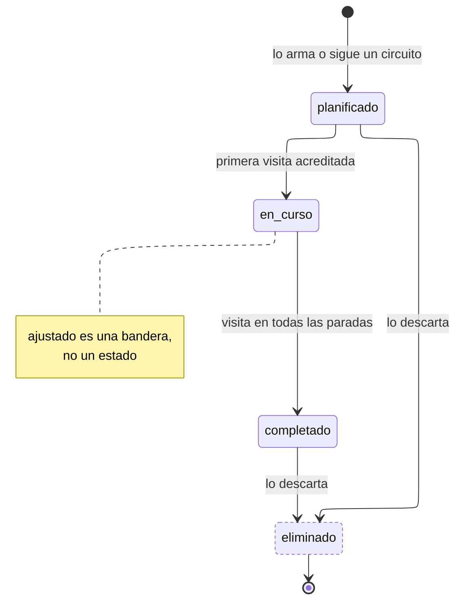

---
hide:
  - toc
icon: lucide/route
---

# Itinerario

Las transiciones a `en_curso` y `completado` no las dispara el turista: las
dispara el sistema al acreditar visitas. La primera visita lo pone en curso; la
visita en la última parada pendiente lo completa.

`ajustado` **no es un estado**: es una bandera de un solo sentido que atraviesa
esta máquina sin alterarla. Un itinerario puede ajustarse estando `planificado` o
`en_curso`, y eso no cambia su estado.

| Estado        | `admite_edicion` | `admite_reserva` | `es_terminal` |
| ------------- | :--------------: | :--------------: | :-----------: |
| `planificado` |      **sí**      |      **sí**      |      no       |
| `en_curso`    |      **sí**      |        no        |      no       |
| `completado`  |        no        |        no        |      no       |
| `eliminado`   |        no        |        no        |    **sí**     |

`en_curso` no tiene salida a `eliminado`: el turista no descarta un recorrido que
está haciendo. Tampoco la tiene si existe una reserva viva sobre él,
así que primero se cierra o cancela el servicio.

De estas tres marcas temporales salen, sin cálculos adicionales, las tres cifras
que la alcaldía mide por separado: **iniciaron** son los itinerarios con
`iniciado_en`, **modificaron** los que tienen `ajustado` en verdadero, y
**completaron** los que tienen `completado_en`.
