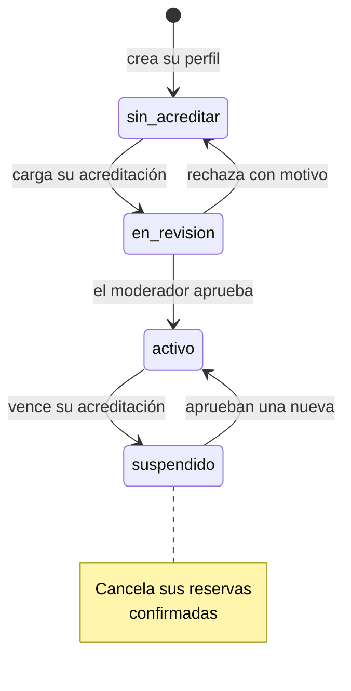
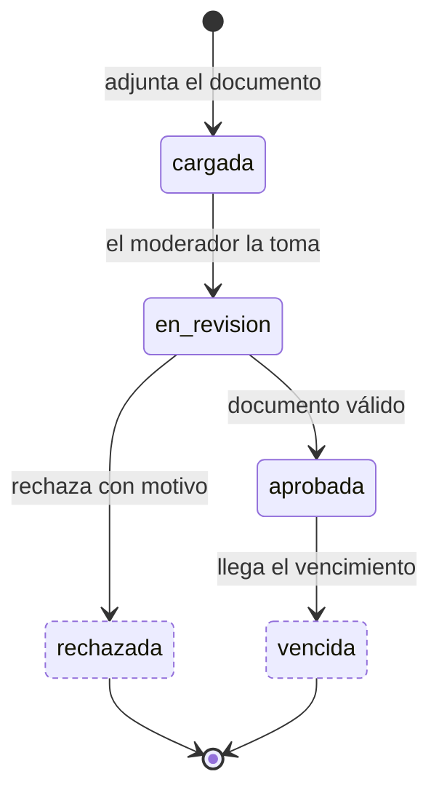

---
hide:
  - toc
icon: lucide/badge-check
---

# Prestador y acreditación

Dos máquinas en paralelo. El perfil es visible mientras tenga **al menos una**
acreditación en `aprobada` y sin vencer; en cuanto la última vence, el proceso
programado lo suspende sin que nadie abra la aplicación.

Renovar no reactiva la acreditación vencida: crea una fila nueva que recorre su
propio ciclo. Es lo que permite conservar el historial de licencias de un guía.

## Perfil del prestador

| Estado | `es_visible` | `acepta_reservas` |
| --- | :-: | :-: |
| `sin_acreditar` | no | no |
| `en_revision` | no | no |
| `activo` | **sí** | **sí** |
| `suspendido` | no | no |

`suspendido` conserva el acceso: el prestador entra a la aplicación para
regularizar sus papeles y atender los servicios ya comprometidos, pero no aparece
en búsquedas ni recibe contrataciones nuevas.

## Acreditación

Solo `aprobada` acredita. Una acreditación `vencida` no se reabre y una
`rechazada` tampoco: en ambos casos el prestador carga un documento nuevo.

Pasar a `suspendido` **cancela sus reservas confirmadas** y avisa a cada turista
con tiempo para buscar otro prestador, con reembolso íntegro. Ningún servicio se
presta sin acreditación vigente: es la misma regla que impide que aparezca en
búsquedas.

El prestador conserva el acceso a la aplicación para regularizar sus papeles y
consultar su historial, pero no puede prestar ni captar.
