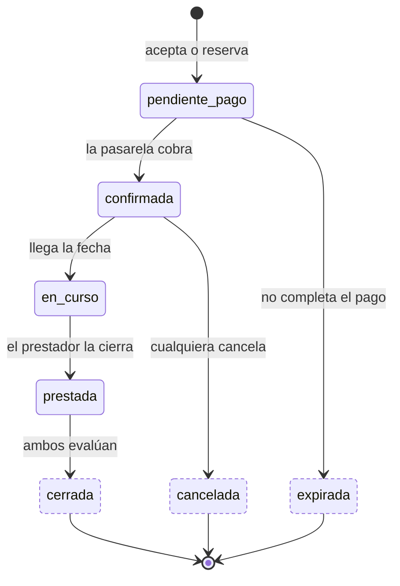

---
hide:
  - toc
icon: lucide/handshake
---

# Reserva

El turista paga al reservar y la plataforma **retiene** el dinero hasta que el
servicio se cierra. Por eso hay dos estados antes del recorrido: uno mientras la
pasarela confirma el cobro y otro cuando el dinero ya está retenido.

Cancelar es libre para ambas partes hasta veinticuatro horas antes; después exige
motivo y cuenta en la reputación de quien cancela.

| Estado | Dónde está el dinero | `admite_cancelacion` | `es_terminal` |
| --- | --- | :-: | :-: |
| `pendiente_pago` | En tránsito, de nadie | no | no |
| `confirmada` | Retenido por la plataforma | **sí** | no |
| `en_curso` | Retenido por la plataforma | no | no |
| `prestada` | Retenido por la plataforma | no | no |
| `cerrada` | Liberado al prestador, menos comisión | no | **sí** |
| `cancelada` | Reembolsado al turista | no | **sí** |
| `expirada` | Nunca se cobró | no | **sí** |

La tarifa se congela al crear la reserva: un ajuste posterior del prestador no la
toca. La comisión se calcula al liberar, con el porcentaje vigente en ese
momento, y queda registrada como fila propia para que el prestador pueda
verificar la resta.

## Quién puede cancelar

| Situación | Motivo | Reputación | Reembolso |
| --- | :-: | :-: | :-: |
| Turista o prestador, con más de 24 h | opcional | no cuenta | íntegro |
| Turista o prestador, con menos de 24 h | **obligatorio** | cuenta | íntegro |
| Expulsión permanente del prestador | automático | ya sancionado | íntegro |
| Acreditación del prestador vencida | automático | no cuenta | íntegro |

Las dos últimas filas no las dispara una persona: las dispara el proceso
programado, y el turista recibe el aviso con tiempo para buscar otro prestador.

!!! warning "Falta un umbral"

    El plazo para completar el pago antes de que la reserva pase a `expirada` no
    está definido. Es el parámetro que falta para cerrar esta máquina.
