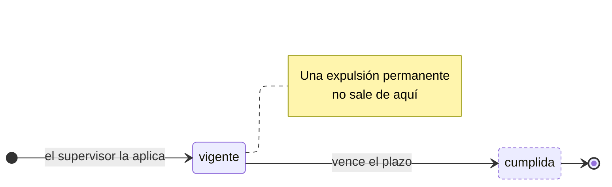

---
hide:
  - toc
icon: lucide/gavel
---

# Sanción

La sanción es la causa; el estado de la cuenta es su consecuencia. Aplicarla
escribe la fila **y** empuja la transición del usuario en la misma transacción:
nunca hay una sanción vigente sobre una cuenta activa.

Una suspensión vence sola; una expulsión no tiene salida. Por eso `vigente` es
terminal cuando el tipo es permanente, y el catálogo lo distingue con
`vence_sola` en lugar de con dos estados distintos.

| Estado     | `restringe_acceso` |     `es_terminal`     |
| ---------- | :----------------: | :-------------------: |
| `vigente`  |       **sí**       | solo si es permanente |
| `cumplida` |         no         |        **sí**         |

| Efecto                              | Suspensión | Expulsión |
| ----------------------------------- | :--------: | :-------: |
| Revoca las sesiones vivas           |     ●      |     ●     |
| Vence sola al cumplirse el plazo    |     ●      |           |
| Cancela las reservas confirmadas    |            |     ●     |
| Veta el dispositivo de origen       |            |     ●     |
| Exige segundo factor para aplicarla |            |     ●     |

El motivo interno es obligatorio en las dos. Es lo que sostiene el historial de
reincidencia: sin la tabla, una segunda suspensión borraría el rastro de la
primera y no habría cómo justificar por qué dos infracciones parecidas
recibieron castigos distintos.

Las sanciones no se borran ni se editan. Levantar una antes de tiempo no está
definido en ninguna fuente; hoy la única salida de `vigente` es que el plazo se
cumpla.
