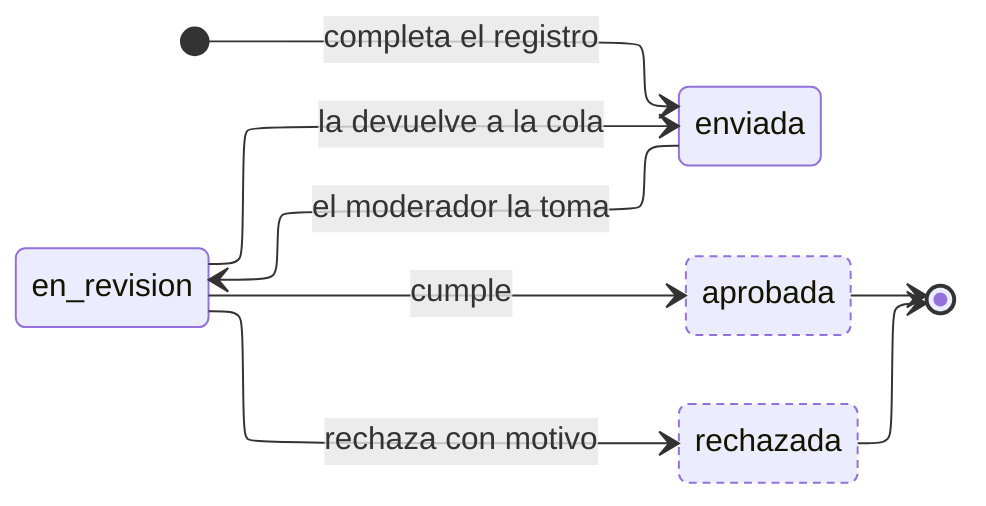

---
hide:
  - toc
icon: lucide/file-check
---

# Verificación

Corre en paralelo a lo que verifica: mientras la acreditación está `cargada` o la
organización `registrada`, su expediente recorre esta máquina. La aprobación es
lo único que hace visible al prestador o al comercio.

`resuelta_en` se fija al alcanzar cualquiera de los dos estados terminales, y es
lo que delimita la bandeja del moderador. La cola se atiende por orden de
llegada.

| Estado        | `en_bandeja` | `es_terminal` |
| ------------- | :----------: | :-----------: |
| `enviada`     |    **sí**    |      no       |
| `en_revision` |    **sí**    |      no       |
| `aprobada`    |      no      |    **sí**     |
| `rechazada`   |      no      |    **sí**     |

Una misma máquina cubre cuatro objetos mutuamente excluyentes: la acreditación de
un prestador, o el registro de un comercio, una alcaldía o una institución
cultural. Lo que cambia entre ellos es el documento exigido y la severidad de la
revisión, no el ciclo.

`rechazada` es terminal **para ese expediente**. Subsanar no lo reabre: el
solicitante carga un documento nuevo y eso genera otra verificación, de modo que
el historial conserva cuántas veces se intentó y por qué se rechazó cada vez.

El motivo es obligatorio al rechazar. Sin él la transición no ocurre, porque un
rechazo sin causa explicada obliga a reintentar a ciegas.
