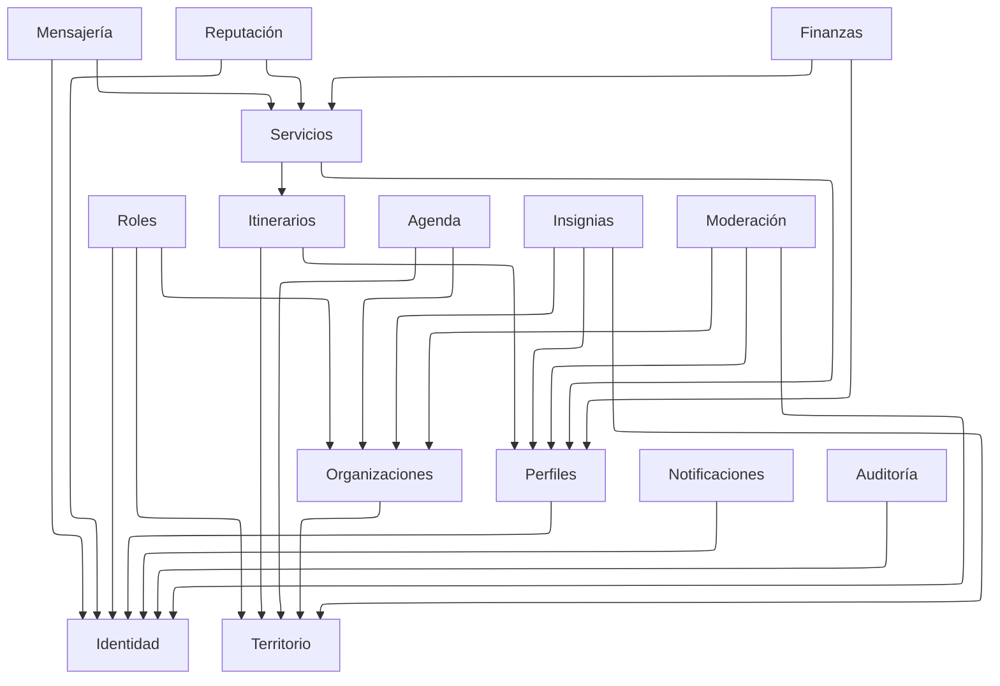

# Modelo de dominio

## Módulos

| # | Módulo | Entidades principales | Requerimientos |
| --- | --- | --- | --- |
| M1 | Catálogos y parámetros | `Parametro`, `Motivo`, `Moneda`, `TasaCambio`, `PilarCultural` | [RF-S-04][rf-s-04], [RF-S-16][rf-s-16] |
| M2 | Identidad y acceso | `Usuario`, `Sesion`, `SegundoFactor`, `Dispositivo`, `IntentoAcceso` | [RF-S-05][rf-s-05], [RF-S-06][rf-s-06], [RF-S-07][rf-s-07] |
| M3 | Roles y permisos | `Rol`, `Permiso`, `AsignacionRol` | [RF-S-08][rf-s-08], [RF-A-03][rf-a-03] |
| M4 | Perfiles y credenciales | `PerfilTurista`, `PerfilPrestador`, `Acreditacion` | [RF-P-01][rf-p-01], [RF-P-02][rf-p-02], [RF-T-23][rf-t-23] |
| M5 | Territorio y circuitos | `Ciudad`, `Alcaldia`, `PuntoInteres`, `CircuitoOficial` | [RF-A-01][rf-a-01], [RF-A-02][rf-a-02], [RF-A-05][rf-a-05] |
| M6 | Itinerarios | `Itinerario`, `ItinerarioParada`, `ItinerarioCircuito` | [RF-T-07][rf-t-07], [RF-T-08][rf-t-08], [RF-T-28][rf-t-28] |
| M7 | Organizaciones y comercios | `Comercio`, `InstitucionCultural`, `ComercioHorario`, `Suscripcion` | [RF-C-01][rf-c-01], [RF-C-04][rf-c-04], [RF-C-11][rf-c-11] |
| M8 | Agenda cultural | `Evento` | [RF-I-01][rf-i-01], [RF-I-06][rf-i-06] |
| M9 | Servicios y reservas | `Recorrido`, `Convocatoria`, `Postulacion`, `Reserva` | [RF-P-08][rf-p-08], [RF-T-15][rf-t-15], [RF-T-18][rf-t-18] |
| M10 | Mensajería | `Conversacion`, `ConversacionParticipante`, `Mensaje` | [RF-S-17][rf-s-17], [RF-S-21][rf-s-21] |
| M11 | Reputación | `Resena`, `ResenaImpugnacion` | [RF-S-22][rf-s-22], [RF-S-25][rf-s-25] |
| M12 | Insignias y cupones | `Insignia`, `VisitaAcreditada`, `MovimientoInsignia`, `CampaniaCupon`, `Cupon` | [RF-S-15][rf-s-15], [RF-C-06][rf-c-06], [RF-T-21][rf-t-21] |
| M13 | Finanzas | `Pago`, `Comision`, `MovimientoSaldo`, `SolicitudRetiro` | [RF-P-16][rf-p-16], [RF-P-18][rf-p-18] |
| M14 | Moderación y sanciones | `SolicitudVerificacion`, `ResolucionVerificacion`, `Reporte`, `Sancion` | [RF-B-01][rf-b-01], [RF-B-07][rf-b-07] |
| M15 | Notificaciones | `Geocerca`, `AvisoEmitido`, `PreferenciaAviso` | [RF-S-16][rf-s-16], [RF-I-05][rf-i-05] |
| M16 | Auditoría | `EventoCambio`, `ContextoPeticion`, `Bitacora`, `Transicion` | [RF-S-10][rf-s-10], [RF-B-10][rf-b-10] |

---

## Mapa de módulos

`A --> B` significa que alguna tabla de `A` tiene una llave foránea hacia una de
`B`. **Catálogos** no se dibuja: lo referencia casi todo y sus aristas
convertirían el mapa en una malla ilegible.

Nadie apunta hacia Mensajería, Reputación, Finanzas, Notificaciones, Moderación
ni Auditoría: son consumidores, observan lo que ocurre en el resto. Son también
los que más crecen —casi todo lo suyo es de solo inserción— y por eso conviene
que ninguna tabla caliente dependa de ellos.

[rf-a-01]: ../requerimientos/funcionales/portal-alcaldias.md#rf-a-01
[rf-a-02]: ../requerimientos/funcionales/portal-alcaldias.md#rf-a-02
[rf-a-03]: ../requerimientos/funcionales/portal-alcaldias.md#rf-a-03
[rf-a-05]: ../requerimientos/funcionales/portal-alcaldias.md#rf-a-05
[rf-b-01]: ../requerimientos/funcionales/backoffice.md#rf-b-01
[rf-b-07]: ../requerimientos/funcionales/backoffice.md#rf-b-07
[rf-b-10]: ../requerimientos/funcionales/backoffice.md#rf-b-10
[rf-c-01]: ../requerimientos/funcionales/portal-comercios.md#rf-c-01
[rf-c-04]: ../requerimientos/funcionales/portal-comercios.md#rf-c-04
[rf-c-06]: ../requerimientos/funcionales/portal-comercios.md#rf-c-06
[rf-c-11]: ../requerimientos/funcionales/portal-comercios.md#rf-c-11
[rf-i-01]: ../requerimientos/funcionales/portal-instituciones.md#rf-i-01
[rf-i-05]: ../requerimientos/funcionales/portal-instituciones.md#rf-i-05
[rf-i-06]: ../requerimientos/funcionales/portal-instituciones.md#rf-i-06
[rf-p-01]: ../requerimientos/funcionales/app-prestadores.md#rf-p-01
[rf-p-02]: ../requerimientos/funcionales/app-prestadores.md#rf-p-02
[rf-p-08]: ../requerimientos/funcionales/app-prestadores.md#rf-p-08
[rf-p-16]: ../requerimientos/funcionales/app-prestadores.md#rf-p-16
[rf-p-18]: ../requerimientos/funcionales/app-prestadores.md#rf-p-18
[rf-s-04]: ../requerimientos/funcionales/plataforma.md#rf-s-04
[rf-s-05]: ../requerimientos/funcionales/plataforma.md#rf-s-05
[rf-s-06]: ../requerimientos/funcionales/plataforma.md#rf-s-06
[rf-s-07]: ../requerimientos/funcionales/plataforma.md#rf-s-07
[rf-s-08]: ../requerimientos/funcionales/plataforma.md#rf-s-08
[rf-s-10]: ../requerimientos/funcionales/plataforma.md#rf-s-10
[rf-s-15]: ../requerimientos/funcionales/plataforma.md#rf-s-15
[rf-s-16]: ../requerimientos/funcionales/plataforma.md#rf-s-16
[rf-s-17]: ../requerimientos/funcionales/plataforma.md#rf-s-17
[rf-s-21]: ../requerimientos/funcionales/plataforma.md#rf-s-21
[rf-s-22]: ../requerimientos/funcionales/plataforma.md#rf-s-22
[rf-s-25]: ../requerimientos/funcionales/plataforma.md#rf-s-25
[rf-t-07]: ../requerimientos/funcionales/app-turista.md#rf-t-07
[rf-t-08]: ../requerimientos/funcionales/app-turista.md#rf-t-08
[rf-t-15]: ../requerimientos/funcionales/app-turista.md#rf-t-15
[rf-t-18]: ../requerimientos/funcionales/app-turista.md#rf-t-18
[rf-t-21]: ../requerimientos/funcionales/app-turista.md#rf-t-21
[rf-t-23]: ../requerimientos/funcionales/app-turista.md#rf-t-23
[rf-t-28]: ../requerimientos/funcionales/app-turista.md#rf-t-28
